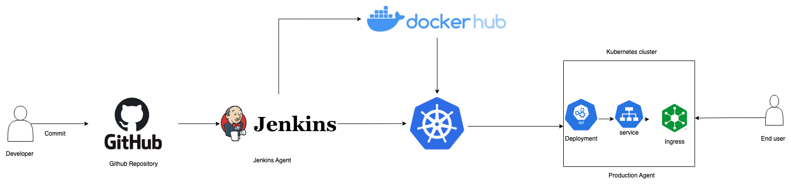

# In-memory-key-value-store
In-memory key-value store application, included DevOps implementation 

To-do list: 
- [x] Create an in-memory key-value store HTTP API Service which implements:
  - [x] /get/<key> -> Return value of the key 
  - [x] /set -> Post call which sets the key/value pair 
- [x] Create Dockerfile for this application 
- [ ] Write CI/CD pipeline to deploy the Docker image to Docker repository (dockerhub)
- [ ] Deploy this image into a Kubernetes cluster, using Jenkins 
- [ ] Write the Service, Ingress for K8s resources 
- [ ] Optimizing the solution 

## 1. Development requirement features of the application 

First of all, We have to analyze the task for a clear implementation.

**Task**: The **in-memory** **key-value** store **API** will allow client to store and retrieve key-value pairs. The API support 2 operations:
- /set: Post call which sets the key/value pair
  
- /get/<key>: Retrieve the value of the key  

```Note: Because this is in-memory store, so all data are not store permently.``` 

So, the behavior API Endpoints will have:
1. Set a key-value pair
- URL: `/set`

- Method: `POST`
  
- Request Body: 
    ```json 
    {
    "key": "key_1",
    "value": "value_1"
    }
    ```
- Success Response:
  - Code: `200 OK`
    ```json
    {
        "status": "success",
        "message": "key-value pair is set successfully"
    }
    ```
1. Get the value of the key
   
- URL : `/get/<key>`
  
- Method: `GET`
  
- URL Parameters: `key` - string
  
- Success Response: 
  
  - Code: `200 OK`
  
  - Content: 
    ```json
    {
        "key": "key_1",
        "value" "value_1"
    }
    ```
- Error Response:

  - Code: `404 Not Found`

  - Content:
    ```json
    {
        "status": "error",
        "message": "Key not found"
    }
    ```
Implementation the API service with Python, Flask framework.


The application code is here: [app](./app/app.py)

## 2. Writing Dockerfile
The Dockerfile is here: [Dockerfile](./Dockerfile)

Verify: Using [verify-api script](./utils/verify-api.sh)
```bash
# Build docker images and docker container from that image

$ docker build -t flask-app .

# Verify the script

$ cd utils
$ chmod +x verify-api.sh
$ ./verify-api.sh
```


## 3. DevOps Evaluation (Kubernetes)

### 3.1. Analysis and design CI/CD infrastructure



We will build kubernetes cluster from docker images, we have to find solution for define specific version of images, and also for optimizing the build time. We will used `tag`. the content of tag will be the hash of the commit in Github repository. 

For example: the image `image1:98f6b2d787dd72d4c0f4e3844ee0f94eafd0d171` is the Docker image version corresponding the commit with hash :`98f6b2d787dd72d4c0f4e3844ee0f94eafd0d171`  

## 3.2. Provision jenkins server in aws with terraform 

Reason to choose `terraform`: Convinient for managing infrastructure.   

The IaC resource is showed here: [IaC for Jenkins Server](./terraform/jenkins_server/)  

We also created a agent server for executing the stages in pipeline. In this server, we install docker using: [install-docker script](./utils/install-docker.sh)

